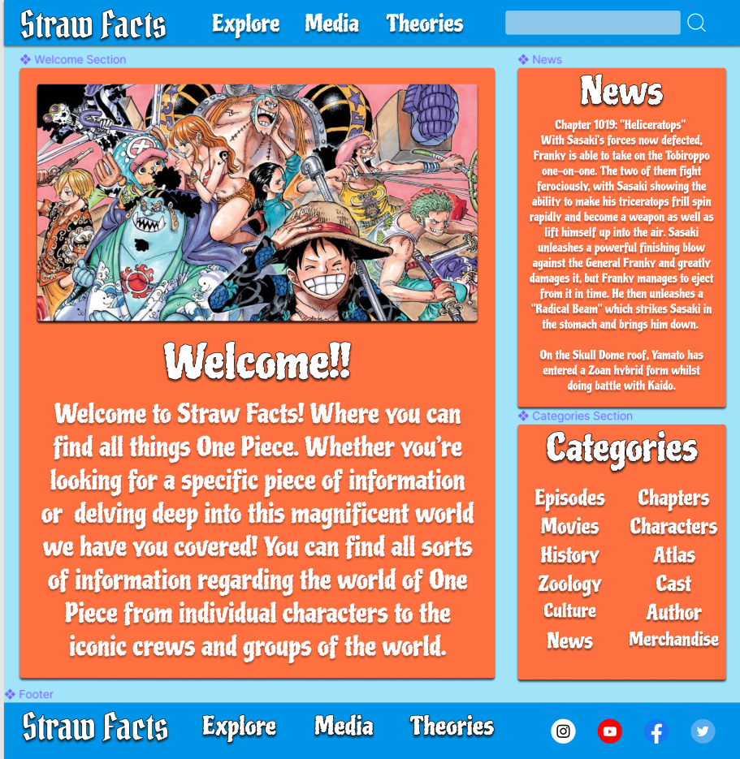
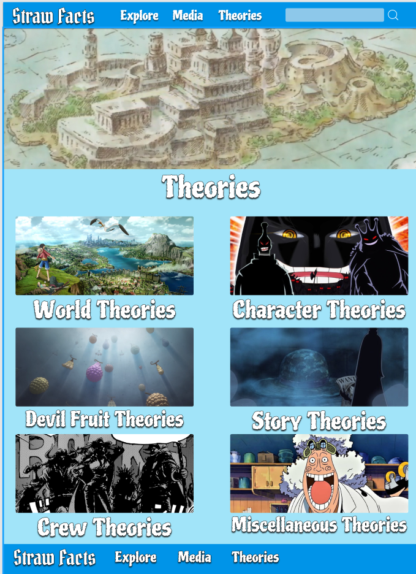
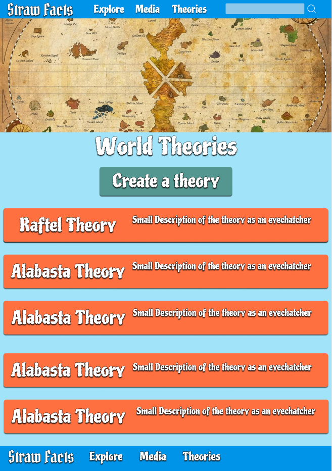
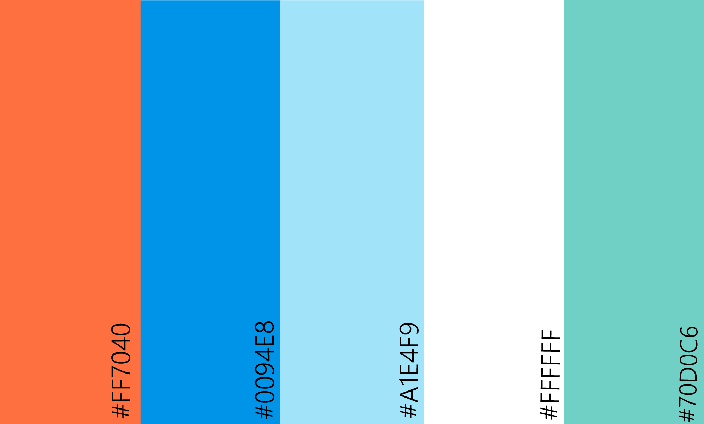

# Straw Facts 
**Straw Facts** is a community-based website for all One Piece enthusiasts looking to share their thoughts and theories with others.

The inspiration for the website came from the countless theories roaming around the internet in different forums and websites, so the idea is to have a place where fans and speculators can create, find, and share their theories with everyone and have one place to find everything rather than having the information spread across different platforms.

[Live Project Here!](https://straw-facts.herokuapp.com/)

# Table of Contents
1. [UX](#UX)
    1. [Project Goals](#Project-Goals)
    2. [User Stories](#User-Stories)
    3. [Development Planes](#Development-Planes)
2. [Data Schema](#Data-Schema)
    1. [Users Collection](#Users-Collection)
    2. [Theories Collection](#Theories-Collection)
3. [Features](#Features)
    1. [Design Features](#Design-Features)
    2. [Features to Implement in the Future](#Features-to-Implement-in-the-Future)
4. [Issues and Bugs](#Issues-and-Bugs)
5. [Technologies Used](#Technologies-Used)
    1. [Languages](#Languages)
    2. [Tools](#Tools)
    3. [Libraries](#Libraries)
    4. [Database Management](#Database-Management)
6. [Testing](#Testing)
7. [Deployment](#Deployment)
    1. [Database Creation](#Database-Creation)
    2. [Local Copy Creation](#Local-Copy-Creation)
    3. [Heroku App Creation](#Heroku-App-Creation)
8. [Credits](Credits)
9. [Acknowledgements](#Acknowledgements)

# UX 
## Project Goals

The main goal of **Straw Facts** is to provide the users with an easy and accessible way to create theories by enabling them to **create, edit, and delete** their theories as they please aswell as access other theories shared by other users.

This is the third project of the Milestone Projects that a learning developer must complete durint their Full Stack Web Development Program at **The Code Institute**.

The requirements for this project are to develop a full-stack website allowing users to manage a common database (in this case, One Piece Theories) using **HTML5, CSS, JavaScript, Python, Flask, and MongoDB.**

## User Goals
The users for this site would be looking for:

* An easy-to-use data management to create theories with **CRUD** conventions to:
    * Create a User Account
    * see their created theories
    * Update their theories
    * Delete their theories

* An easy-to-use user management system
    * Create a user account.
    * See their created theories.
    * Edit their created theories.
    * Delete their created theories.

* A easy to navigate and aesthetically apropriate site

## Developer / Site Owner Goals

* The developer is looking to:
    * Create a community-based application that they themselves would use to find, and create theories for their passion for One Piece and it's many mysteries.

    * Demonstrate their knowledge and practical usage of the variety of softwares, languages, databases, and libraries learned throughout the course. 

    * Deploy a project they are proud of and have invested a lot of time and effort on.

# User Stories

## As a General User, I want to:

1. Be able to easily discover theories.

2. Be able to create my own theories and edit them if I feel the need to as we learn of new information and delete the theory all together if it no longer is relevant or has been proven right or wrong.

## As a Non-Registered user, I want to:

1. To be able to browse through the theories freely.

2. To Create an account when the need to create a theory arises.

## As a Registered user, I want to:

1. Log into my account and gain full access to all that the site has to offer

2. Navigate to my user profile and see the theories I have created.

3. Navigate to the create page and add my own theory into the site.

4. Be able to edit and delete my own theories

## As an Administrative Account holder, I want to:

1. Be able to edit and delete any theory as needed

# Development Planes

When thinking of the design and creation process of the web application the developer noticed several requirements for the functionality of the site and how it would meet the demand from the user stories above. To answer that demand he came up with Development Planes:

## 1. Strategy

* Roles:
    * New Users(None-Registered)
    * Returning Users(Registered)

* Demographic:
    * One Piece Enthusiasts
    * Anime Lovers
    * Theory Fans

The website needs to enable the user to:

* Register/Login to an account

* Create a theory
* Edit a theory of their making
* Delete a theory of their making
* Browse and Discover new theories 

* View Theories containint this information:
    * Theory Title
    * Theory Author
    * Theory Content

## 2. Scope

A scope was defined to identify what needed to be done in order to align features with the strategy previously defined. This was broken into two categories:

* Content Requirements 
    * The user will be looking for:
        * Upload their own theories
        * Edit their own theories
        * Delete their own theories
        * Easy Navigation 
        * A suitable theme

* Functionality Requirements
    * The user will be able to:
        * Register/Login to an account
        * Create a theory
        * Edit the theory they created
        * Delete the theory they created
        * Discover New Theories

## 3. Structure

The information architecture was organized in order to ensure that users could navigate through the site with ease and efficiency, with the following results:

The user will start in the home page then have the ability to look at theories form the get go without the need to make an account. When the user decides they want to create a theory they will be required to create an account. Users will also only be able edit and delete their own theories.

## 4. Skeleton

The Wireframe was created in [Figma](figma.com) with the user expirience in mind:

A lot of the content displayed in the wireframe was removed from the final site as the developer made the decision to maximize the navigation and thus improving the user expirience.

Home Page:

Theories Page:

Sub Categories Page:

### Post Wireframe Changes 
While the developer used the wireframe for the main idea, aesthetic, and the desired design, there are several major differences between the mockups and the final application:

* Most notably, the content of the website was greatly reduced to greatly focus on the theory aspect of the page as the developer did not deem the other information displayed as important since it is a theory website and not an information/wiki the desired audience for the application will already have an extensive knowledge on the topic at hand. By cutting that much content the user experience was greatly improved as the theory navigation was made much easier.

* The log in and registration features were added later on as it was clear that users will want to be able to edit and delete their theories and for security reasons it couldn't be accessible to everyone and thus the create an account feature was implemented.

## 5. Surface
* **Color Scheme**
    * The chosen color scheme was specifically chosen to compliment the colors of the Anime.

* **Typography**
    * The main font chosen is [Piedra](https://fonts.google.com/specimen/Piedra?query=piedra). It has a very old and piraty look to it which is the main theme of One Piece! 

    * The logo uses the [Pirata](https://fonts.google.com/specimen/Pirata+One?query=pirata) font since it's the most Pirate themed font.

* Imagery 
 * The imagery used throught the project was taken from google images mostly as the developer does not own the rights to the One Piece anime. 

[Back to top ⇧](#table-of-contents)

## Data Schema

For this project, [MongoDB](https://www.mongodb.com/) was used to store the datasets. within the created database, the collections can be divided into two types:

### Users Collection 
* When registering an account, the user provides:
    * Username (Unique Identifier)
    * Password (hashed)

### Theories Collections

* When creating a theory the user will have the option to choose what category the theory will go into:
     * World Theories
     * Character Theories
     * Devil Fruit Theories
     * Story Theories
     * Crew Theories
     * Mischellaneous Theories

* All these different categories are their own collections in orde to separate the different theories and not have them all mixed up in one big collection. 

* When creating a theory the user provides: 
    * Category in which they wish their theory be stored
    * A title for their theory
    * The theory itself or as labeled as the content

# Features 
## Design Features
Each page of the website is fully responsive and has an adaptable navbar so it can be utilized to it's full capicity when being viewed from any device.

* At the top of the page there is a navbar which allows acess to all the other pages in the website and it's content changes depending whether the user has created an account or has logged in displaying the Profile and Log Out buttons. 

* The Footer displays the same amount of content with one exception the social links which will take the user to a page related to the topic in the respective social media platform.

* Throught the website the use of the class **box** is utilized to display the orange box that wrappes all the content throught the page to give the page a more vibrant look all throughout.

* The use of Banners is used when navigating throught the theories to give the viewer a feel of what type of content to expect if the category title wasn't enough of a hint.

* Each category has a small thumbnail that reflects on the type of theories that will be found there.

* The sub theory categories each contain their own banner related to the topic they're displaying. Each one consists of a title, a create button that takes the user to the create page and the theories, which are displayed utilizing the above mentioned box to match the theme of the site.

* The create and edit pages both consist of a form wrapped around the **box** class and it contains an input to write the title, and the content of the theory as well as an option tab where the user can choose what category they would like their theory to be in.

## Features to Implement in the Future
* Display Picture
    * Give users the option to inser profile images to better express themselves.

* Image Upload 
    * This feature would be mainly used when writing a theory give the users the ability to insert pictures to better explain their theory and use as examples when making a point.

* Search Bar
    * This feature would be implemented when the number of theories inside of the website starts to impact the navigation of the page if there are too many theories it will become harder to go back and look for old theories a user might've liked

* Comments
    * A big part of sharing theories with a community is to recieve feed back and have a conversation/discussion about the theory and it could be a great user engagement.

[Back to top ⇧](#table-of-contents)

# Issues and Bugs 

## **Commits**
* **Very Important**
    * When reviewing the project with the mentor it was noticed that the commits were saved in an unorthodox way and that caused all of the commit messages to be reassigned to "add".
    The mentor pointed out this error and the rest of the commits where done properly unfortunately this mistake was noticed until the very last meeting where most of the progress was already done and the damage was irreversible.

## Index.html
* The boxes throught the Index page don't match in height depending on the device they're seen on. The developer tried to increase the height of the boxes but it left a huge empty space that took away from the overall look of the page so he opted to leave the boxes so be different heights rather having huge white spaces throught

## Banners 
* Some of the banner displayed in the sub theories are over extended if viewed from big displays as the developer couldn't find theme apropriate images that were the required size and the required resolution. 

[Back to top ⇧](#table-of-contents)

# Technologies Used
## Languages 
* [HTML5](https://en.wikipedia.org/wiki/HTML)
* [CSS](https://en.wikipedia.org/wiki/CSS)
* [JavaScript](https://en.wikipedia.org/wiki/JavaScript)
* [Python](https://en.wikipedia.org/wiki/Python_(programming_language))

## Tools 
* **Gitpod**
    * Git Pod was used as the preferred IDE.

* [GitHub](https://github.com/)
    * Git Hub was used to store the project repository.

* [Heroku](https://id.heroku.com/login)
    * Heroku was used to deploy the website

* [Figma](https://www.figma.com/)
    * Used to create the wireframe during the design phase of the project

* [Photoshop](https://www.photoshop.com/en)
    * To edit the website mockup, create the color pallette and edit the favicon.

* [Favicon](https://favicon.io/)
    * Used to create the icon displayed in the tab

* [Font Awesome](https://fontawesome.com/)
    * Used to add the icons used throughout the website

## Libraries
* [Bootstrap](https://getbootstrap.com/)
    * Used as the css framework used to implement the responsiveness of the site.

* [jQuery](https://jquery.com/)
    * Was used to simplify the JavaScript code used. 

* [Google Fonts](https://fonts.google.com/)
    * Google fonts was used to import the "Piedra" and the "Pirata" fonts used throughout the website.
    
* [Flask](https://flask.palletsprojects.com/en/2.0.x/) 
    * Glask was used as the web framework for the application.

* [PyMongo](https://pypi.org/project/pymongo/)
    * flask_pymongo was used a communication line between the MongoDB database and Python.

* [Werkzeug](https://werkzeug.palletsprojects.com/en/2.0.x/)
    * Werkzeug was used for password hashing and authentication.

## Database Management 
* [MongoDB](https://www.mongodb.com/)
    * MongoDB was the chosen database for this website.
* [MongoDB Atlas](https://www.mongodb.com/cloud/atlas)
    * MongoDB Atlas was the cloud database service used to host the database.

[Back to top ⇧](#table-of-contents)

# Testing 

# Deployment
To further improve upon this project, a clone cna be made using the following steps

## 1. Database Creation
The application is connected to a [MongoDB Atlas](https://www.mongodb.com/cloud/atlas) cluster. A database can be created usign the following steps.

1. Log into [MongoDB](https://www.mongodb.com/) 
2. Locate and select the **New Project** button on the right side of the page, and give your project a name.
3. Locate and select the **Create a New Cluster** button on the right side of the page.
    * Choose the free **Shared Cluster** optiuon
    * Select a Regiona and Clous Provider (in my case: AWS and Ireland)
    * Select the Cluster tier and select the option best suited for you (for this project the Basic M0 Tier)
    * Click on the Cluster Name and create a cluster name
4. Select the Database Acess on the left side of the page. Once Selected click Add New Database User:
    * Choose Password for the Authentication Method
    * Enter a username and password of your choosing
    * Select the Read and Write to any database option in the Database User Privilage.
    * Add User

5. Select the Network Access under the Database Acess on the left side of the page. Then click on the Add Ip Adress: 
    * Select Allow Acess from anywhere

6. Locate and select the Clusters on the left side.

7. Click collections, then Create Database on the left side of the page to start adding documents to your database collections:
    * Enter Chosen DB name
    * Enter Collection Name
    * Select create

8. Click Create Collection and create the necessary collections.

## Local Copy Creation
A clone of the repository can be done it two ways:

* Forking the Repository
    * By forking the github repository we make a copy of the original repository on out Github account to view and make changes without affecting the original and here's how to do it:
        * Log into [GitHub](https://github.com/))   
        * Find the GitHub Repository
        * At the top right side of the page select **"Fork"**.
        * A copy of the original repository will be added into your account. 

## Creating a Clone

How to run this project locally:

1. Install the [GitPod Browser](https://www.gitpod.io/docs/browser-extension/) Extension for Chrome.
2. Restart your browser after downloading
3. Log into [GitHub](https://github.com/)
4. Locate the repository.
5. CLick the gree "GitPod" button to open the workspace.

## Heroku App Creation
The website requires back-end technology, including a server, application and database.

* Using the Herokue Command Line Interface
* Connect to the GitHub Repository

Before deployment, certain steps have to be accomplished first.

1. Create a requirements file to install requirements. In the terminal window type: 

pip3 install -r requirements.txt

2. Create a Procfile so that Heroku knows which file runs the app. In the terminal window type:

echo web: python app.py > Procfile

3. Push the two files to the repository
**Do Not Use Source Control**

git add requirements.txt
git commit -m "Add requirements.txt"

git add Procfile 
git commit -m "Add Procfile"

git push

Once that's done:

1. Log into [Heroku](https://id.heroku.com/login)
2. Select the New Button and choose Create New App. Give your app a name and set the region (this project: Europe) and Create App
3. Go to the Deploy tab and select Connect to GitHub
4. Search for the repository name (make sure it's spelled correctly). Then click Connect
5. Go to Settings and select Reveal Config Vars:
    * IP : 0.0.0.0
    * PORT : 5000
    * SECRET_KEY : (your secret key)
    * MONGO_URI : mongodb+srv://<username>:<password>@<cluster_name>-ocous.mongodb.net/<database_name>?retryWrites=true&w=majority
    * MONGO_DBNAME : (your mongodbname)
6. Go back to the deploy tab and scroll down to Automatic Deploys.
7. Ensure the master branch is selected by selecting View App

Heroku will Recieve the pushed code from GitHub and Host the application

[Back to top ⇧](#table-of-contents)

The developer consulted mulptiple sites so better understand the code implemented in the design.

Both The Code Institute Flask Project and The Task Manager Mini Project were used as reference to develop the many features implemented. The developer customized the code to better fit the website.

The Developer consulted various websites when encountering a problem:

[Stack Overflow](https://stackoverflow.com/)

[W3Schools](https://www.w3schools.com/)

[Boostrap](https://getbootstrap.com/)

[One Piece Information](https://onepiece.fandom.com/wiki/One_Piece_Wiki)

[The Theories](https://www.reddit.com/)

[Images](https://www.google.com/imghp?hl=EN)

[Youtube for a few troubleshooting problems](https://www.youtube.com/)

[Back to top ⇧](#table-of-contents)

# Acknowledgements

The developer would like to thanks the following:

* Tim Nelson, for the great lesson and walkthrough videos in the projects

* Their Mentor Seun, for her great advice and great help and ideas.

* Their family and friends, for providing an enourmous amount of patience and understanding aswell as being extremelly supporting throughout the whole process.
